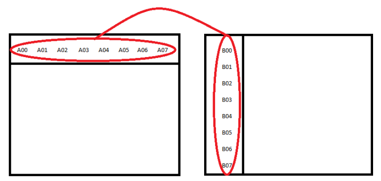

# Parallel_Processing
Parallel processing for matrix multiplication in different sizes.

This project has been divided into five sections. In the first section, matrix multiplication has been performed sequentially. In the second section, the first part of the project has been parallelized and executed using OMP. In the third section, the first part has been parallelized and executed using MPI. 

In the fourth and fifth sections, the method of performing the multiplication operation has changed, and matrix multiplication has been carried out by dividing the matrices into smaller matrices. In the fourth section, this task has been parallelized using OMP, and in the fifth section, it has been parallelized using MPI.

Each of these sections has been executed in two modes. The first mode is such that matrix B is stored in a row-wise manner, and then the multiplication operation is performed. The second mode is such that matrix B is stored in a column-wise manner, and the multiplication operation is carried out. For column-wise storage, matrix B has been stored in a one-dimensional array named "Bcolumn," and for the multiplication in this case, the array B is used. 

Note that each of these sections could be performed on larg matrices. 

# Part 1
Matrix multiplication has been performed sequentially. The multiplication operation time, when matrix B is stored in a column-wise manner, is significantly lower compared to the time taken when it's stored in a row-wise manner.

# Part 2
After performing the multiplication sequentially, in this stage, the operations are parallelized using OMP. Here, using the 'collapse' directive, nested loops are parallelized. For parallelization in accordance with the question's requirements, two outer loops are parallelized, and consequently, C[i][j] becomes the smallest executable unit. This operation is executed as shown below. As evident in the diagram, the multiplication of a row by a column calculates a C[i][j], and the continuation of the operation also proceeds in parallel as illustrated.

